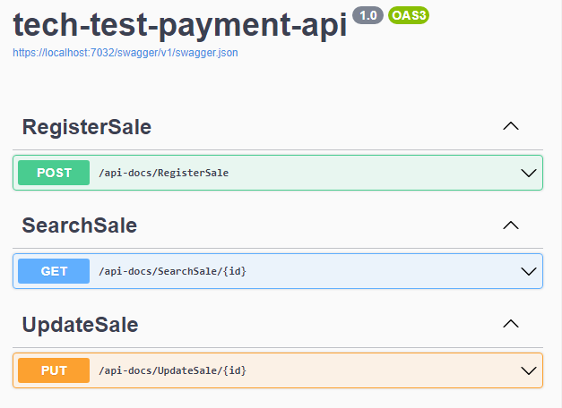
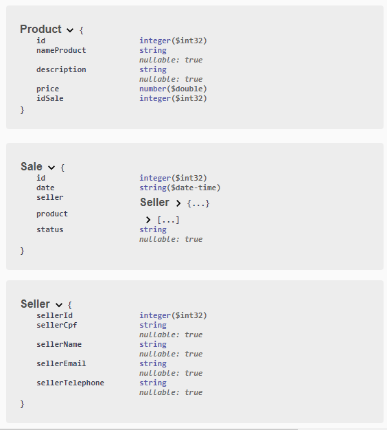
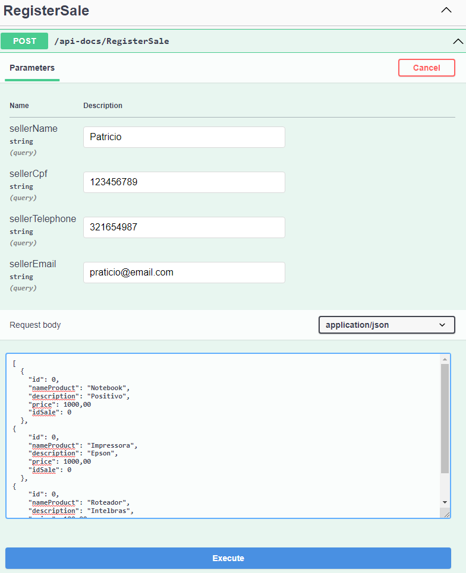
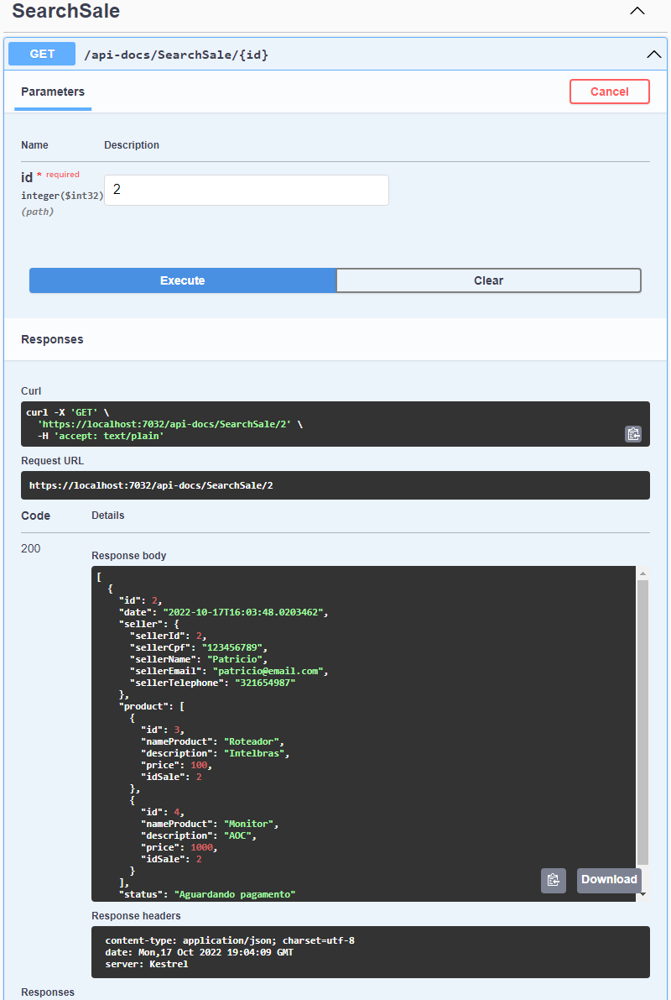
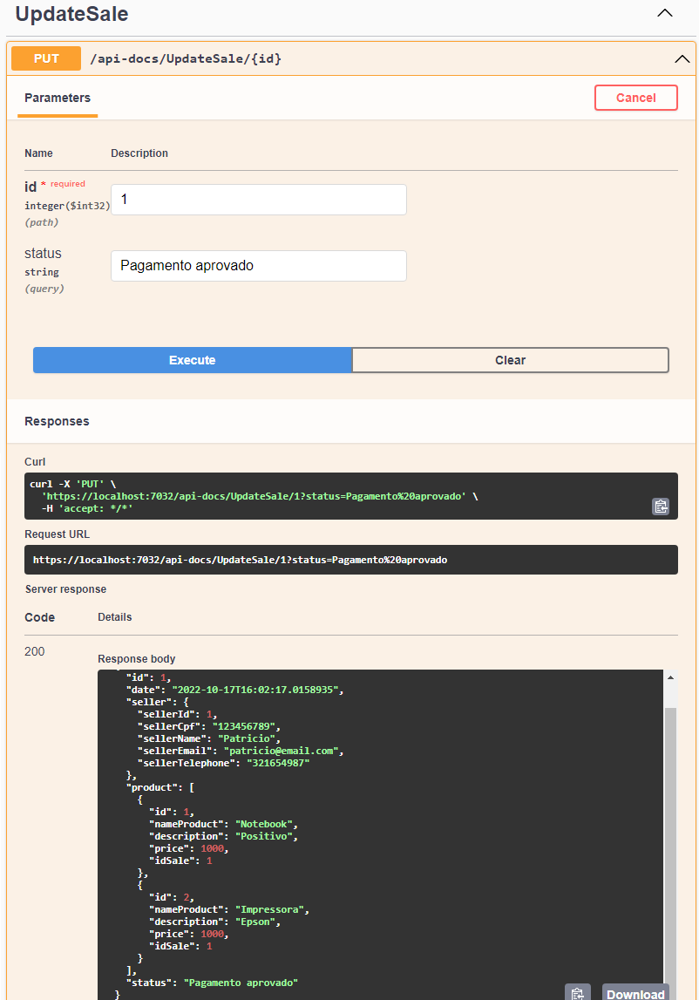
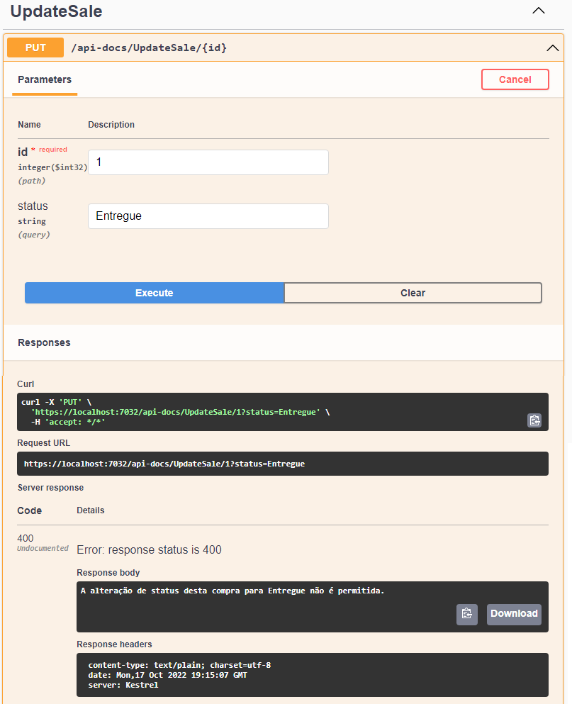

## TESTE TÉCNICO BOOTCAMP POTTENCIAL .NET DEVELOPER

API REST construída utilizando .Net.

- A API possui 3 operações:
1) Registrar venda: Recebe os dados do vendedor + itens vendidos. Registra venda com status "Aguardando pagamento";

2) Buscar venda: Busca pelo Id da venda;

3) Atualizar venda: Permite que seja atualizado o status da venda.

* OBS.: Possíveis status: `Pagamento aprovado` | `Enviado para transportadora` | `Entregue` | `Cancelada`.

